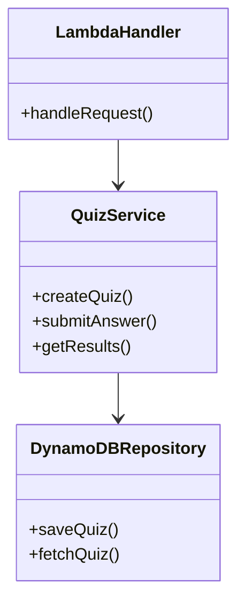

# Galactic Quiz

The **Galactic Quiz** is a backend application designed for the Caylent quiz event at AWS Community Day 2024. It leverages modern cloud-native technologies, including AWS services and TypeScript, to deliver a scalable and maintainable solution.

---

## Table of Contents
1. [Overview](#overview)
2. [Architecture](#architecture)
3. [Setup](#setup)
4. [Development Workflow](#development-workflow)
5. [Deployment](#deployment)
6. [Useful Commands](#useful-commands)
7. [Conventional Commits Guide](#conventional-commits-guide)
8. [License](#license)

---

## Overview

This project is built using **TypeScript** and follows **Clean Architecture** principles to ensure scalability and maintainability. It uses the **AWS Cloud Development Kit (CDK)** for Infrastructure as Code (IaC) and integrates with **GitHub Actions** for CI/CD pipelines.

Key features:
- **Event-Driven Architecture (EDA)** for handling quiz events.
- **AWS Lambda** for serverless compute.
- **Amazon DynamoDB** for a highly available and scalable database.
- **Docker** for local development and testing.

---

## Architecture

The application follows **Clean Architecture** and **Domain-Driven Design (DDD)** principles. Below is a high-level architecture diagram:



---

## Setup

### Prerequisites

Ensure the following tools are installed on your system:
- **Yarn v3** (via `corepack`)
- **AWS SAM CLI**  
  - macOS: `brew install aws-sam-cli`
- **Docker**

### Installation

1. Clone the repository:
   ```bash
   git clone https://github.com/your-org/galactic-quiz.git
   cd galactic-quiz
   ```

2. Install dependencies:
   ```bash
   yarn install
   ```

3. Start the development server:
   ```bash
   yarn dev
   ```

---

## Development Workflow

### Running Locally

1. Ensure Docker is running in the background.
2. Start the API using:
   ```bash
   yarn dev
   ```

### Testing

Run unit tests using Jest:
```bash
yarn test
```

### Linting and Formatting

Ensure code quality with:
```bash
yarn lint
yarn format
```

---

## Deployment

The application is deployed using **AWS CDK** and a CI/CD pipeline configured via **GitHub Actions**. Any changes pushed to the `dev` branch are automatically deployed.

For manual deployment:
1. Synthesize the CloudFormation template:
   ```bash
   yarn cdk synth
   ```

2. Deploy the stack:
   ```bash
   yarn cdk deploy
   ```

> **Note:** The `.env.example` file is provided for manual deployments. No manual configuration is required for the CI/CD pipeline.

---

## Useful Commands

| Command               | Description                                         |
|-----------------------|-----------------------------------------------------|
| `yarn build`          | Compile TypeScript to JavaScript.                   |
| `yarn watch`          | Watch for changes and recompile.                    |
| `yarn test`           | Run unit tests using Jest.                          |
| `yarn lint`           | Run ESLint to check for code quality issues.        |
| `yarn format`         | Format code using Prettier.                         |
| `yarn cdk deploy`     | Deploy the stack to your AWS account/region.        |
| `yarn cdk diff`       | Compare deployed stack with the current state.      |
| `yarn cdk synth`      | Emit the synthesized CloudFormation template.       |

---

## Conventional Commits Guide

This project follows the **Conventional Commits** specification to ensure consistent and meaningful commit messages.

### Commit Message Format

```
<type>[optional scope]: <description>

[optional body]

[optional footer]
```

### Commit Types

| Type       | Description                                                   |
|------------|---------------------------------------------------------------|
| `feat`     | A new feature (triggers a **minor version bump**).            |
| `fix`      | A bug fix (triggers a **patch version bump**).                |
| `chore`    | Routine tasks like updating dependencies or configurations.   |
| `docs`     | Documentation updates.                                        |
| `style`    | Code style updates (e.g., formatting, whitespace).            |
| `refactor` | Code restructuring without changing functionality.            |
| `perf`     | Performance improvements.                                     |
| `test`     | Adding or updating tests.                                     |
| `ci`       | Continuous Integration-related changes.                       |
| `build`    | Changes affecting build scripts, dependencies, or CI/CD.      |
| `revert`   | Reverts a previous commit.                                    |

### Examples

#### Feature Addition
```bash
git commit -m "feat(auth): add JWT token validation"
```

#### Bug Fix
```bash
git commit -m "fix(api): resolve null pointer exception in handler"
```

---

## License

This project is licensed under the [MIT License](LICENSE).

---